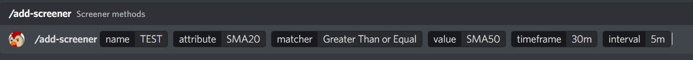
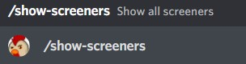
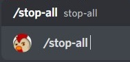
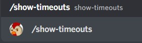

# TRADING VIEW SCREENER BOT


## Contact Details

GitHub: https://github.com/jezztify

Email: jessnarsinues@gmail.com

Discord: LoveContagion#7538

# Content

## Description
> This bot is written using the DiscordTS framework. It aims to get information from Trading View's Screener by filtering it depending on the user's indicator criteria.

> It currently supports the following indicators
```
1. SMA20/SMA50/SMA100
2. RSI
3. %CHANGE
```

# Installation
### Requirements
> NodeJS >=16.0.0

> NPM >= 7.0.0

### Clone Repository
> git clone https://github.com/jezztify/trading-view-screener-bot.git

### Running locally
> cd /path/to/trading-view-screener-bot

> BOT_TOKEN=BOT_TOKEN_HERE

>npm install

>npm run start

# Usage
> Adding a screener



> Showing all screeners



> Stopping all screeners



> Showing all timeouts




# Need help?

You can open an issue in our [Github repository](https://github.com/jezztify/trading-view-screener-bot/issues)

# Thank you
```
Please feel free to give a star if you like this project.
It would mean a lot to me if you could also share your thoughts on how to improve it through the issue section.
```