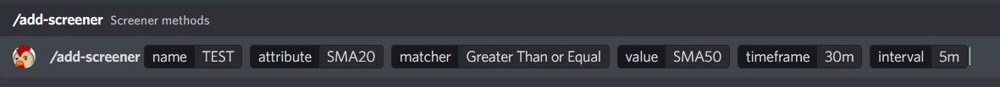
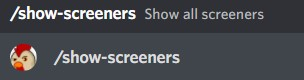
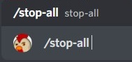
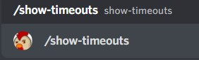

# TRADING VIEW SCREENER BOT

## Contact Details

GitHub: https://github.com/jezztify

Email: jessnarsinues@gmail.com

Discord: LoveContagion#7538

# Content

## Description
```
This bot aims to get information from Trading View's Screener. It is initially aimed to work for the Crypto screener but it can be modified for other types as well.
```

## Installation
> Clone Repository
```bash
git clone https://github.com/jezztify/trading-view-screener-bot.git
```
> Running locally
```bash
cd /path/to/trading-view-screener-bot
BOT_TOKEN=BOT_TOKEN_HERE
npm install
npm run start
```
> Running via Docker-Compose
```bash
cd /path/to/trading-view-screener-bot
edit docker-compose.yml > add bot token
docker-compose build
docker-compose up -d
```

# Usage
> Adding a screener



> Showing all screeners



> Stopping all screeners



> Showing all timeouts




# Need help?

You can open an issue in our [Github repository](https://github.com/jezztify/trading-view-screener-bot/issues)

# Thank you
```
Please feel free to give a star if you like this project.
It would mean a lot to me if you could also share your thoughts on how to improve it through the issue section.
```